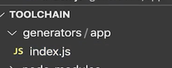

# yeoman

> 制作脚手架的生成器，
>
> https://yeoman.io/authoring/index.html

   - 先初始化npm  --  npm init 

   - 安装yeoman

   - ```
     npm install yeoman-generator -g
     或
npm install -g yo
     ```
     
   - 创建目录结构

          -  

- 初始化代码

  ```js
  var Generator = require('yeoman-generator');
  module.exports = class extends Generator {
    // The name `constructor` is important here
    constructor(args, opts) {
      // Calling the super constructor is important so our generator is correctly set up
      super(args, opts);
  
      // Next, add your custom code
      this.option('babel'); // This method adds support for a `--babel` flag
    }
      method1() {
      this.log('method 1 just ran');
    }
  
    method2() {
      this.log('method 2 just ran');
    }
  };
  ```

  

- 修改package.json 

  - Name: 必须是 generator 开头

  - main入口修改为：对应index入口

  - ```
    {
      "name": "generator-toolchain",
      "version": "1.0.0",
      "description": "",
      "main": "generators/app/index.js",
      "scripts": {
        "test": "echo \"Error: no test specified\" && exit 1"
      },
      "author": "",
      "license": "ISC"
    }
    
    ```

- npm link 

  > 安装项目依赖到本地文件

- 运行 yeoman    

  ```
  yo toolchain //   "name": "generator-toolchain", 去掉前缀--》 toolchain
  ```


- prompt  命令行交互功能  https://yeoman.io/authoring/user-interactions.html

  ```js
  async prompting() { //异步method
      const answers = await this.prompt([  //This.prompt 提示用户输入的对象
        {
          type: "input",
          name: "name",
          message: "Your project name",
          default: this.appname // Default to current folder name
        },
        {
          type: "confirm",
          name: "cool",
          message: "Would you like to enable the Cool feature?"
        }
      ]);
  
      this.log("app name", answers.name);
      this.log("cool feature", answers.cool);
    }
  ```

  

- 文件系统（跟文件做交互）

  - app目录下，创建templates目录，再创建html文件
  - 

- ```js
   
  <html>
    <head>
      <title><%= title %></title>
    </head>
  </html>
  
  
  writing() {
          this.fs.copyTpl(
            this.templatePath('t.html'), //读取对应html
            this.destinationPath('public/index.html'), // 输出目标文件
            { title: 'Templating with Yeoman' } // 将title替换
          );
        }
  ```

- 

- 依赖系统

  - 生成package.json

    - ```js
       writing() {
          const pkgJson = {
            devDependencies: {
              eslint: '^3.15.0'
            },
            dependencies: {
              react: '^16.2.0'
            }
          };
        
          // Extend or create package.json file in destination path
          this.fs.extendJSON(this.destinationPath('package.json'), pkgJson);
        }
        
      ```

    -  Npm install

    - ```js
      install() {
          this.npmInstall(); //内置方法
        }
      ```

# 遇到的问题

## webpack 指令 报错

- 

- 原因：
  
  > webpack-cli 内部会安装 webpack； 刚开始不知道，导致安装了2次
  
  ```js
    this.npmInstall(['webpack', 'vue-loader', 'vue-template-compiler', 'vue-style-loader',
         'css-loader', 'copy-webpack-plugin','webpack','webpack-cli'], { 'save-dev': true });
  ```
  
  改为
  
  ```js
  this.npmInstall(['webpack', 'vue-loader', 'vue-template-compiler', 'vue-style-loader',
      'css-loader', 'copy-webpack-plugin','webpack-cli'], { 'save-dev': true });
  ```
  
  

## <e> unable to locate "src/public/*.html" at "/xxx/project/src/public/*.html"

> 暂未排查出问题